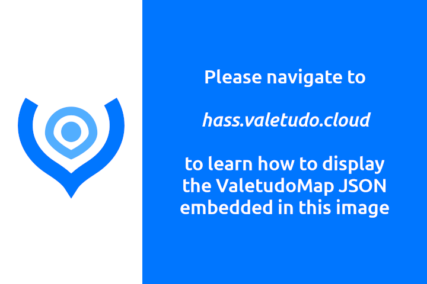

# Getting the Valetudo Map into Home Assistant

Hi!

This site serves as a short set of instructions to get your Valetudo Map data into your Home Assistant Dashboard.

If you're looking for general Valetudo Home Assistant documentation, please head over to the docs at 
[https://valetudo.cloud/pages/integrations/home-assistant-integration.html](https://valetudo.cloud/pages/integrations/home-assistant-integration.html)

## How?

To achieve what you see in this picture, you need to do the following:

First, please install the [Valetudo Map Card](https://github.com/Hypfer/lovelace-valetudo-map-card). 
The recommended way to do that is by using HACS. Installation instructions can be found in that repository.

Then, when it is installed correctly, click "Edit Dashboard" in the top right corner

Now, please click on "Add Card" in the bottom right corner.

You should now see a dialog that looks somewhat like this:

There, type "Valetudo" and click on the search result. 
If there is no search result, then chances are that the Card wasn't installed successfully.

Now, you should see this dialog:

Here, you should enter the Unique System ID of your Valetudo-enabled robot.

You can find that information either in Home Assistant,

or in the Valetudo Webinterface on the System Information page.

With that ID entered, the dialog should now look similar to this

Now, just click save, and you should have your Valetudo map in your Home Assistant Dashboard. 
There are quite a few customization options for this card.

Make sure to check out [its documentation](https://github.com/Hypfer/lovelace-valetudo-map-card#options) to e.g., find out how to scale the image.

## Why?

So why all this hassle you may ask. Very good question.

The first important thing to know is that the robots' firmware does not upload images as in png or jpeg to Valetudo.
Instead, they all have custom binary map data formats, which contain information such as the path, what rooms there are, what their names are etc., which all get mapped to the standard ValetudoMap JSON data format. 
Therefore, to get an Image that you as a Human can view out of that, this data needs to be parsed and rendered to a regular plain image.

Due to technical limitations such as CPU or RAM budgets, this rendering process can't be done on the robot itself. 
Instead, this task is done by the Valetudo Frontend or the Valetudo Map Card for Home Assistant. 
Apart from shifting the resource demands to the client, this also has the neat benefit that the client can decide what exactly it wants to render.

For example, you might want to render only the outer walls of the map. 
Or maybe you want to render the robots path as thick as the robot itself to get a better feel of which area it has actually cleaned.

Furthermore, you don't have to render the Map Data to an image. Instead, what about rendering it [to a Minecraft World instead](https://github.com/Hypfer/Valetudo-Minecraft-Mapper)? 
Or maybe [a Source Engine Game Level](https://github.com/Sch1nken/Valetudo-To-VMF)?

With that out of the way, you might be wondering why the process of getting the Map Data into Home Assistant needs some extra steps and what exactly is going on with this image.

If you have a default Home Assistant setup, then everything that gets autodiscovered via MQTT will have every state transition stored in the History by the
recorder component. This works well for almost anything but leads to horrific results when combined with a `sensor` entity containing a multiple megabyte large JSON that changes every three seconds.

This leads to
- terrible history performance
- the disk filling up with irrelevant data
- the home assistant devtools view struggling to display all entities
- kittens crying
- many more bad things

Initially, this made it impossible to autodiscover the Valetudo Map as users absolutely had to exclude the data from the recorder component or else see above.

Here is where that Image comes in. 
As it turns out, the image file format PNG isn't only capable to store image data.
Instead, it is also able to contain arbitrary strings. You might see where this is going.

By cutting away the `IEND` PNG chunk, we can inject a `zTXt` PNG chunk that contains our deflated ValetudoMap JSON into that image.
Then, we reattach that `IEND` chunk, and we're done.

We now have a regular PNG image file that _also_ contains a regular ValetudoMap JSON string.
And the best thing about it is that it is all 100% according to the PNG spec. No hacks with random trailing data involved.

For more information, feel free to [check out the PNG spec](https://www.w3.org/TR/2003/REC-PNG-20031110/).

So what did we gain by this? 
Well, there is _one_ type of Home Assistant entity that _can_ be autodiscovered via MQTT **but also** doesn't end up in the recorder component: The `camera.mqtt`.
`camera.mqtt` entities are available in Home Assistant, can be autodiscovered with no configuration required and - due to the nature of image data - aren't stored in the recorder component.

By embedding our ValetudoMap JSON into an image, we thus can get our Map Data into Home Assistant with Autodiscovery without wrecking the recorder component.
That is why you're only seeing that static image and why we need a custom Card to display the MapData stored inside it.

Our card takes that container image, extracts the `zTXt` chunk containing the ValetudoMap JSON and renders that to a html5 canvas in your browser.